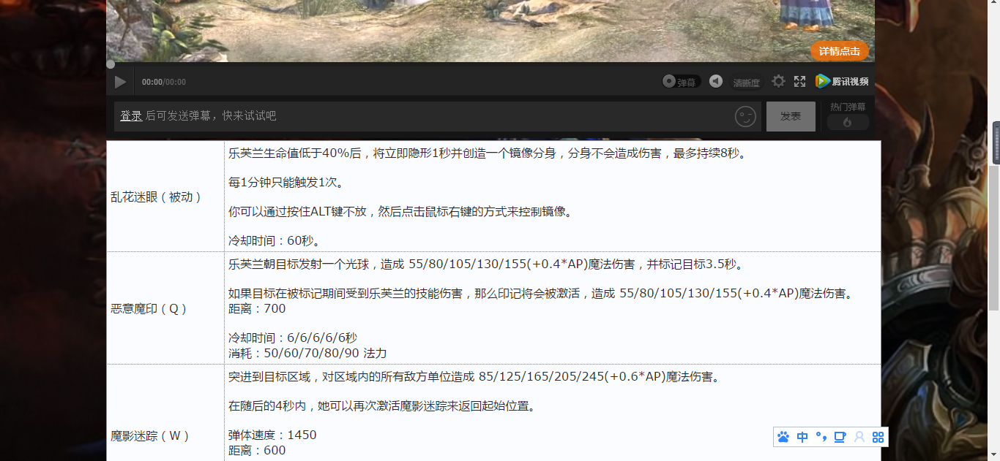

game_hero_data

英文项目名称game_hero_data，game hero指游戏中的英雄,data意思为”数据，资料”，就是指在《英雄联盟》这款游戏中英雄相关资料的说明。

# 简介 
网络游戏英雄联盟的英雄资料查询，输入方面用户可输入想查询英雄的名或称号（如“盖伦”和“德玛西亚之力”），输出方面则是该英雄的视频资料，被动技能以及其“Q、W、E、R”技能的描述、冷却时间、消耗法力值等方面的资料，共134个英雄的资料，数据来源于[带玩游戏平台](http://lolapi.games-cube.com/GetChampionDetail?champion_id={champion_id})取得的json档。

## 输入：
用户输入英雄名或英雄称号，交互界面使用到[HTML5之datalist标签](http://www.w3school.com.cn/html5/html5_datalist.asp)，所以用户可以用英雄名或英雄称号的片段找所需要的指标。详细见[templates/entry.html](templates/entry.html)
## 输出：
用户得到输出结果为：英雄的视频资料、技能等2个方面的数据，详细见[templates/results.html](templates/results.html)

## 从输入到输出，除了flask模块，本组作品还使用了：

### 模块
* [requests](http://docs.python-requests.org/zh_CN/latest/user/quickstart.html)
* [json](https://docs.python.org/2/library/json.html)
### 数据
*  从 [带玩游戏平台](http://lolapi.games-cube.com/GetChampionDetail?champion_id={champion_id})
上，将134个英雄的资料保存到本地，见[data](data)
*  资料类型：字典包字典  
### API
* 来源：[带玩游戏平台](http://lolapi.games-cube.com/GetChampionDetail?champion_id={champion_id})
* 数据清理：每个英雄都有以各自英文名做文件名称的json档，方便调用

## Web APP动作描述

 以下是web请求前的准备工作

1. 在[collect_data.py]collect_data.py)中，def collect_champion()函数，调用api，生成一个含有所有英雄简要资料的json档[data/champion.json](data/champion.json)保存到本地的[data](data)文件夹中。def get_dict_champion()函数，读取[data/champion.json](data/champion.json)并返回一个英雄简要资料的字典。用函数get_dict_champion()，调用字典dict_champion，以集合推导的方式，建立以id号为键，英雄英文名为值的小字典dict_id(见代码dict_id = {x['id']:x['ename'] for x in dict_champion['data']})。由于每个英雄在api里都是以各自的id号为网址的后部分，为了节省api的令牌，建立只有id号的列表list_id（见代码list_id = list(dict_id.keys())），跑含有id号的网址 , 并把每个id号下的英雄以其英文为文件名，输成json档，最终结果为134个英雄json档，保存到本地的[data](game_hero_data/data)文件夹中。

2. 在[input_data.py](input_data.py)中，def get_dict_ename()函数，打开[data/champion.json](data/champion.json)，返回一个以英雄英文名为键，中文名和称号为值的字典(见代码dict_ename = {x['ename']:{'cname':x['cname'],'title':x['title']} for x in a['data']})，用做后面的函数和网页的表单界面，目标是用户输入英雄的中文名和称号都能得到想要的结果。def change_name()函数，将英雄的中文名和称号转换成英文名，调用函数get_dict_ename()，运用for循环，当出现某个英雄的中文名或称号时，返回英雄的英文名，目的是当用户输入中文的时候，调用这个函数，在代码中用英文名来寻找文档。def get_dict_hero(name)函数，调用以上两个函数，输入英雄中文名或称号时，返回英雄对应的以英文名命名的json档的字典，如果输入的名称不存在，返回'error'字符串

* 以下按web 请求（web request） - web 响应 时序说明

1. 后端伺服器启动：执行 game_hero_data.py 启动后端伺服器，等待web 请求。启动成功应出现： * Running on http://127.0.0.1:5000/ (Press CTRL+C to quit)

2. 前端浏览器web 请求：访问 http://127.0.0.1:5000/ 启动前端web 请求

3. 后端伺服器web 响应：[game_hero_data.py](game_hero_data.py) 中执行了@app.route('/') 下的 entry_page()函数，以HTML模版[templates/entry.html](templates/entry.html)及一个含英雄名称及英雄别称的列表（见代码 the_list_name = list_name）产出的产生《英雄联盟英雄技能信息》的HTML页面

4. 前端浏览器收到web 响应：出现HTML页面有HTML表单的输入 input 类型(type) 为"text"，变数名称(name)为'input_hero_name'，使用了HTML5的datalist 定义在 list="name"" 及 datalist标签，详见HTML模版[templates/entry.html](templates/entry.html)

5. 前端浏览器web 请求：用户选取指标后按了提交钮「搜索」，则产生新的web 请求，按照form元素中定义的method='POST' action='/search4'，以POST为方法，动作为/search4的web 请求

6. 后端服务器收到用户web 请求，匹配到@app.route('/search4', methods=['POST'])的函数 do_search()

7. [game_hero_data.py](game_hero_data.py)文件调用[input_data.py](input_data.py) 中 def get_dict_ename() 等三个函数，把用户提交的数据，以flask 模块request.form['input_hero_name']	取到Web 请求中，并放到函数的参数中运行得到输出数据，再使用flask模块render_template 函数以templates/results.html模版为基础（输出），其中模版中output_skill_passive_name的值，用dict_hero['data'][0]['passive']['name']这变数之值，其他4项值如此类推。

8. 前端浏览器收到web 响应：模版中[templates/results.html](templates/results.html) 的变数值正确的产生的话，前端浏览器会收到正确响应，看到指标的相关元数据。

## 作者成员：
见[_team_.tsv](_team_/_team_.tsv)
